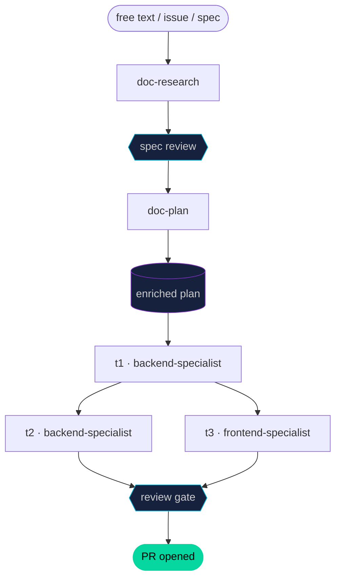

[](https://github.com/leocosta/octopus)

---


# Octopus

Centralized AI agent configuration for multi-repo teams. One source of truth for coding standards, architecture context, and tool-specific settings across all your repositories and AI coding assistants.

Configure once via `.octopus.yml`, run `octopus setup`, and Octopus generates the right configuration for every AI assistant your team uses — Claude Code, GitHub Copilot, OpenAI Codex, Gemini, and OpenCode. Each assistant has different capabilities; Octopus handles these differences automatically through a manifest-driven architecture.

New repos start from **bundles** — curated packages of skills + roles + rules by intent (`starter`, `quality-gates`, `growth`, `cross-stack`, `dotnet-api`, …). The Quick-mode wizard picks the right bundles for you via a few yes/no questions, so you never need to memorize the skill catalog to get a sensible config. Power users keep full control via Full mode or explicit lists in the manifest.

## Installation

**Linux / macOS:**
```bash
curl -fsSL https://github.com/leocosta/octopus/releases/latest/download/install.sh | bash
```

**Windows (PowerShell):**
```powershell
irm https://github.com/leocosta/octopus/releases/latest/download/install.ps1 | iex
```

**Windows (Git Bash / WSL):** same as Linux/macOS.

To install a specific version:
```bash
curl -fsSL https://github.com/leocosta/octopus/releases/latest/download/install.sh | bash -s -- --version v1.26.0
```

After installation, verify with `octopus doctor`.

## Quick Start

```bash
# 1. Install the CLI (see Installation above)

# 2. Run setup — Quick mode asks 4–6 yes/no questions and maps your
#    answers to the right bundles (starter + quality-gates + cross-stack + ...)
octopus setup

# 3. Fill in your .env.octopus with tokens (for MCP servers you selected)

# 4. Commit
git add .octopus.yml .gitignore
git commit -m "chore: add octopus config"
```

Prefer editing a manifest by hand? Copy `.octopus.example.yml` from the
[release](https://github.com/leocosta/octopus/releases/latest) into your
repo as `.octopus.yml`, then run `octopus setup`. For per-component control
(individual skills, roles, mcp) pick Full mode at the wizard prompt — see
[bundles.md](docs/features/bundles.md) for when Full mode pays off.

## Configuration

```yaml
# Which AI agents to configure
# Available: claude, copilot, codex, gemini, opencode
agents:
  - claude
  - copilot

# Bundles — curated packages of skills + roles + rules by intent.
# Available: starter, quality-gates, growth, docs-discipline, cross-stack, dotnet-api, node-api
# Prefer bundles over picking individual skills — run `octopus setup` to let the
# Quick-mode wizard pick bundles for you via a few yes/no persona questions.
bundles:
  - starter
  - quality-gates
  - dotnet-api

# Language rules — coding standards applied to all agents
# Available: common (always included), csharp, typescript, python
# Bundles already set rules (e.g. dotnet-api → csharp); use this for extras.
rules: []

# Skills — optional extras on top of what bundles provide.
# Available: adr, audit-all, backend-patterns, context-budget, continuous-learning, debugging, cross-stack-contract, dotnet, e2e-testing, feature-lifecycle, feature-to-market, implement, money-review, plan-backlog-hygiene, receiving-code-review, release-announce, security-scan, tenant-scope-audit
skills: []

# Hooks — lifecycle automation (Claude Code only)
hooks: true

# Destructive-action guard (default: true when hooks: true).
# Blocks `rm -rf`, `git push --force`, `DROP TABLE`, `DELETE FROM`
# without `WHERE`, and similar. Bypass with
# `# destructive-guard-ok: <reason>` on the command itself.
destructiveGuard: true

# MCP servers — external tool integrations
# Available: notion, github, slack, postgres
mcp:
  - notion
  - github

# Workflow commands — PR, branch, and review automation
# Requires: gh (GitHub CLI) >= 2.0
workflow: true

# GitHub reviewers for PRs
reviewers:
  - github-username

# Roles — agent personas with project context
# Available: product-manager, backend-specialist, frontend-specialist, tech-writer, social-media
roles:
  - product-manager
  - backend-specialist

# Custom project commands — become slash commands with octopus: prefix
commands:
  - name: db-reset
    description: Reset the database
    run: make db-reset

# Language configuration (optional)
language:
  docs: pt-br
  code: en
```

## Features

| Feature | Description | Docs |
|---|---|---|
| **Bundles** | Curated packages of skills + roles + rules by intent — the primary setup path | [bundles.md](docs/features/bundles.md) |
| **Rules** | Language-specific coding standards | [rules.md](docs/features/rules.md) |
| **Skills** | Reusable AI capabilities | [skills.md](docs/features/skills.md) |
| **Hooks** | Lifecycle automation (Claude Code) | [hooks.md](docs/features/hooks.md) |
| **Roles** | Agent personas with project context | [roles.md](docs/features/roles.md) |
| **Knowledge** | Modular domain knowledge | [knowledge.md](docs/features/knowledge.md) |
| **Commands** | Custom slash commands | [commands.md](docs/features/commands.md) |
| **Feature Lifecycle** | RFC/Spec/ADR documentation system | [feature-lifecycle.md](docs/features/feature-lifecycle.md) |
| **MCP Servers** | External tool integrations | [mcp.md](docs/features/mcp.md) |
| **Workflow** | PR and branch automation | [workflow.md](docs/features/workflow.md) |
| **Control** | TUI dashboard for local multi-agent orchestration | [below](#octopus-control) |
| **Run** | End-to-end pipeline from requirement to PR | [below](#octopus-run) |
| **Ask** | Terminal-first agent delegation with live streaming | [below](#octopus-ask) |

See also: [Capability Matrix](docs/capability-matrix.md) · [Agent Manifests](docs/agent-manifests.md) · [Project Structure](docs/project-structure.md)

---

## Octopus Control

A terminal dashboard for running and monitoring multiple AI agents locally — no web browser, no cloud account required.

```bash
octopus control                                          # open interactive TUI
octopus control --plan docs/plans/user-auth.md          # run a pipeline plan
octopus control --install-deps                           # install Python deps (first run)
```

### TUI layout

```
┌─ 🐙 Octopus Control ──────────────────────────────────────────┐
│  ┌─ Agents ──────────────────────────────────────────────────┐ │
│  │ ⠙ backend-specialist  1m42s  Reading src/auth/middlewar…  │ │
│  │ ⠋ tech-writer         0m08s  Writing ADR decision…        │ │
│  │ ○ frontend-specialist idle                                 │ │
│  └───────────────────────────────────────────────────────────┘ │
│  ┌─ Queue  2 running · 1 waiting ────┐  ┌─ Schedule ─────────┐ │
│  │ ● backend-specialist  security-s… │  │ daily 09:00 sec-sc  │ │
│  │ ● tech-writer         doc-adr     │  └────────────────────┘ │
│  │ ○ frontend-specialist –           │                          │
│  └────────────────────────────────────                          │
│  ┌─ Output · tech-writer · live ─────────────────────────────┐ │
│  │ 10:02:07  Writing ADR decision rationale▋                  │ │
│  └───────────────────────────────────────────────────────────┘ │
│  [a]dd  [k]ill  [ctrl+d] clean queue  [tab] focus  [q]uit      │
└────────────────────────────────────────────────────────────────┘
```

The agents roster shows **elapsed time + last log line** (mini-feed) for each running agent, so you can monitor all parallel agents at a glance. Navigating with `↑↓` updates the Output panel to that agent's full log in real time.

### Delegating to a specific agent

**From the TUI** — select an idle agent with `↑↓`, press `a` or `Enter`. The command bar opens pre-filled with `@<role>: `:

```
@tech-writer: write the ADR for JWT authentication
```

You can also type `@role:` directly without navigating first — it routes to the correct agent regardless of cursor position.

**From the terminal** — use [`octopus ask`](#octopus-ask) without opening the TUI.

### Keybindings

| Key | Action |
|---|---|
| `↑↓` | Navigate agents (updates Output panel to that agent's log) |
| `a` or `Enter` | Delegate to selected agent — opens `@role:` pre-filled command bar |
| `k` | Kill selected agent |
| `Ctrl+D` | Clean up completed tasks from queue |
| `Tab` | Cycle panel focus |
| `q` | Quit (prompts stop / detach / cancel if agents are running) |

### Scheduling agents

Create `.octopus/schedule.yml` to trigger tasks automatically:

```yaml
- id: daily-security
  when: "daily 09:00"
  role: backend-specialist
  skill: security-scan
  enabled: true

- id: weekly-docs
  when: "Mon 08:00"
  role: tech-writer
  skill: release-announce
  enabled: true
```

---

## Octopus Run

`octopus run` drives a feature from any starting point — a description, a GitHub issue, or an existing spec — all the way to an open PR. Independent tasks execute in parallel on separate agents.

### Entry points

```bash
# Free text — full pipeline: research → spec → plan → agents → PR
octopus run "implement JWT authentication with refresh tokens"

# From a GitHub issue
octopus run --from-issue gh:123

# From an existing spec (skips research)
octopus run --from-spec docs/specs/user-auth.md

# From an existing enriched plan (executes directly)
octopus run --plan docs/plans/user-auth.md

# Skip the spec review pause (automation mode)
octopus run --skip-spec-review "add email verification"
```

### How it works



Tasks with no shared dependencies run in parallel. Each task runs in an isolated git worktree so agents never conflict.

### Enriched plan format

`/octopus:doc-plan` generates this automatically. You can also write it by hand:

```markdown
---
slug: user-auth
generated_by: octopus:doc-plan
pipeline:
  review_skill: octopus:codereview
  pr_on_success: true
tasks:
  - id: t1
    agent: backend-specialist
    depends_on: []
  - id: t2
    agent: backend-specialist   # runs after t1
    depends_on: [t1]
  - id: t3
    agent: frontend-specialist  # runs in parallel with t2
    depends_on: [t1]
  - id: t4
    agent: tech-writer          # runs after t2 and t3 both finish
    depends_on: [t2, t3]
---

- [ ] **t1** — Create `users` table and migration
- [ ] **t2** — Implement auth endpoints (POST /login, POST /register)
- [ ] **t3** — Login screen and registration form
- [ ] **t4** — Document the auth API
```

Checkboxes are ticked in the plan file as tasks complete. If a task fails, the runner pauses and prompts `[r]etry  [s]kip  [a]bort`.

### Execution timeline example

```
t=0s    t1 dispatched  (backend-specialist)
t=90s   t1 ✓ → t2 and t3 dispatched in parallel
t=90s   t2 running (backend-specialist)
t=90s   t3 running (frontend-specialist)
t=210s  t2 ✓
t=240s  t3 ✓ → t4 dispatched
t=310s  t4 ✓ → review gate
t=400s  review ✓ → PR #42 opened
```

---

## Octopus Ask

`octopus ask` dispatches a task to a specific agent and streams its output live in the terminal — no TUI required.

```bash
octopus ask tech-writer "write ADR for JWT authentication"
octopus ask backend-specialist "run security audit on src/auth/"
octopus ask tech-writer "write the ADR" --skill octopus:doc-adr
octopus ask tech-writer "write the ADR" --dry-run
```

### Live output

```
◆ tech-writer · write ADR for JWT authentication
──────────────────────────────────────────────────
10:02:01  Reading docs/specs/user-auth.md...
10:02:04  Checking existing ADRs in docs/adr/...
10:02:07  Creating docs/adr/0012-jwt-authentication.md
10:02:21  Writing consequences...
⠙ running  0m22s

──────────────────────────────────────────────────
✓ done  0m31s
  log: .octopus/logs/tech-writer.log
```

`Ctrl+C` during streaming prompts `[k]ill  [d]etach  [c]ancel`. Choosing detach keeps the agent running in the background — open `octopus control` to monitor it.

### Options

| Option | Description |
|---|---|
| `--skill <skill>` | Invoke a specific Octopus skill (e.g. `octopus:doc-adr`) |
| `--model <model>` | Override model (`opus`, `sonnet`, `haiku`) |
| `--dry-run` | Print the resolved prompt without launching the agent |

## Updating

```bash
octopus update          # update to latest
octopus update --pin    # update and pin version in lockfile
```

Or via the AI agent (if `workflow: true`):
```
/octopus:update
```

## Requirements

- Bash 4+ (Linux/macOS/WSL) or Git for Windows (PowerShell)
- Python 3 (for JSON merging — MCP injection and hooks)
- `gh` (GitHub CLI) >= 2.0 — only if `workflow: true`

## Troubleshooting

See [docs/troubleshooting.md](docs/troubleshooting.md).

## Contributing

1. Fork the repo and create a branch: `feat/<description>`, `fix/<description>`
2. Follow patterns in existing agents, rules, and skills
3. Run tests before opening a PR:
   ```bash
   for t in tests/test_*.sh; do bash "$t"; done
   ```
4. Open a PR targeting `main`

See [docs/agent-manifests.md](docs/agent-manifests.md) for how to add new agents, rules, skills, or MCP servers.

## License

MIT — see [LICENSE](./LICENSE) for details.
