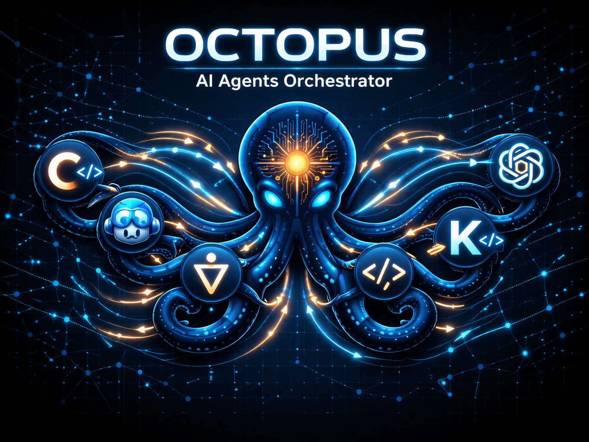

[](https://github.com/leocosta/octopus)

---


# Octopus

Centralized AI agent configuration for multi-repo teams. One source of truth for coding standards, architecture context, and tool-specific settings across all your repositories and AI coding assistants.

Configure once via `.octopus.yml`, run `octopus setup`, and Octopus generates the right configuration for every AI assistant your team uses — Claude Code, GitHub Copilot, OpenAI Codex, Gemini, and OpenCode. Each assistant has different capabilities; Octopus handles these differences automatically through a manifest-driven architecture.

## Installation

**Linux / macOS:**
```bash
curl -fsSL https://github.com/leocosta/octopus/releases/latest/download/install.sh | bash
```

**Windows (PowerShell):**
```powershell
irm https://github.com/leocosta/octopus/releases/latest/download/install.ps1 | iex
```

**Windows (Git Bash / WSL):** same as Linux/macOS.

To install a specific version:
```bash
curl -fsSL https://github.com/leocosta/octopus/releases/latest/download/install.sh | bash -s -- --version v0.15.0
```

After installation, verify with `octopus doctor`.

## Quick Start

```bash
# 1. Install the CLI (see Installation above)

# 2. Copy and edit the configuration
cp octopus/.octopus.example.yml .octopus.yml
# Edit .octopus.yml — choose your agents, rules, and features

# 3. Run setup
octopus setup

# 4. Fill in your .env.octopus with tokens (for MCP servers)

# 5. Commit
git add .octopus.yml .gitignore
git commit -m "chore: add octopus config"
```

> **Submodule users:** replace `octopus setup` with `./octopus/setup.sh`.

## Configuration

```yaml
# Which AI agents to configure
# Available: claude, copilot, codex, gemini, opencode
agents:
  - claude
  - copilot

# Language rules — coding standards applied to all agents
# Available: common (always included), csharp, typescript, python
rules:
  - csharp
  - typescript

# Skills — reusable AI capabilities
# Available: adr, backend-patterns, context-budget, continuous-learning, dotnet, e2e-testing, feature-lifecycle, security-scan
skills:
  - adr
  - e2e-testing

# Hooks — lifecycle automation (Claude Code only)
hooks: true

# MCP servers — external tool integrations
# Available: notion, github, slack, postgres
mcp:
  - notion
  - github

# Workflow commands — PR, branch, and review automation
# Requires: gh (GitHub CLI) >= 2.0
workflow: true

# GitHub reviewers for PRs
reviewers:
  - github-username

# Roles — agent personas with project context
# Available: product-manager, backend-specialist, frontend-specialist, tech-writer, social-media
roles:
  - product-manager
  - backend-specialist

# Custom project commands — become slash commands with octopus: prefix
commands:
  - name: db-reset
    description: Reset the database
    run: make db-reset

# Language configuration (optional)
language:
  docs: pt-br
  code: en
```

## Features

| Feature | Description | Docs |
|---|---|---|
| **Rules** | Language-specific coding standards | [rules.md](docs/features/rules.md) |
| **Skills** | Reusable AI capabilities | [skills.md](docs/features/skills.md) |
| **Hooks** | Lifecycle automation (Claude Code) | [hooks.md](docs/features/hooks.md) |
| **Roles** | Agent personas with project context | [roles.md](docs/features/roles.md) |
| **Knowledge** | Modular domain knowledge | [knowledge.md](docs/features/knowledge.md) |
| **Commands** | Custom slash commands | [commands.md](docs/features/commands.md) |
| **Feature Lifecycle** | RFC/Spec/ADR documentation system | [feature-lifecycle.md](docs/features/feature-lifecycle.md) |
| **MCP Servers** | External tool integrations | [mcp.md](docs/features/mcp.md) |
| **Workflow** | PR and branch automation | [workflow.md](docs/features/workflow.md) |

See also: [Capability Matrix](docs/capability-matrix.md) · [Agent Manifests](docs/agent-manifests.md) · [Project Structure](docs/project-structure.md)

## Updating

```bash
octopus update          # update to latest
octopus update --pin    # update and pin version in lockfile
```

Or via the AI agent (if `workflow: true`):
```
/octopus:update
```

## Requirements

- Bash 4+ (Linux/macOS/WSL) or Git for Windows (PowerShell)
- Python 3 (for JSON merging — MCP injection and hooks)
- `gh` (GitHub CLI) >= 2.0 — only if `workflow: true`

## Troubleshooting

See [docs/troubleshooting.md](docs/troubleshooting.md).

## Contributing

1. Fork the repo and create a branch: `feat/<description>`, `fix/<description>`
2. Follow patterns in existing agents, rules, and skills
3. Run tests before opening a PR:
   ```bash
   for t in tests/test_*.sh; do bash "$t"; done
   ```
4. Open a PR targeting `main`

See [docs/agent-manifests.md](docs/agent-manifests.md) for how to add new agents, rules, skills, or MCP servers.

## License

MIT — see [LICENSE](./LICENSE) for details.
